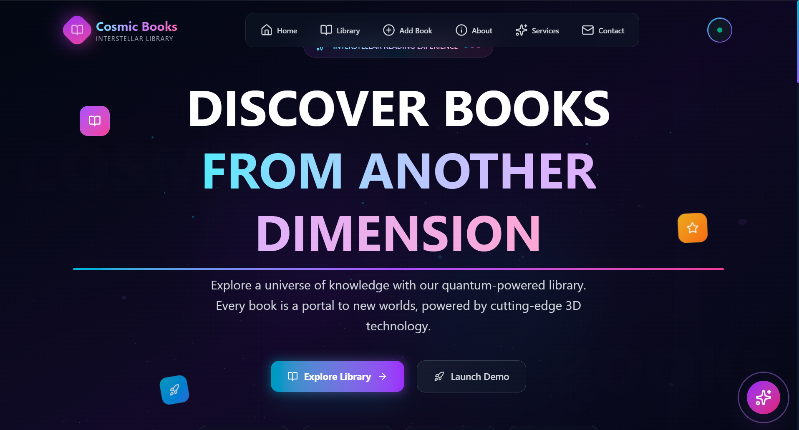
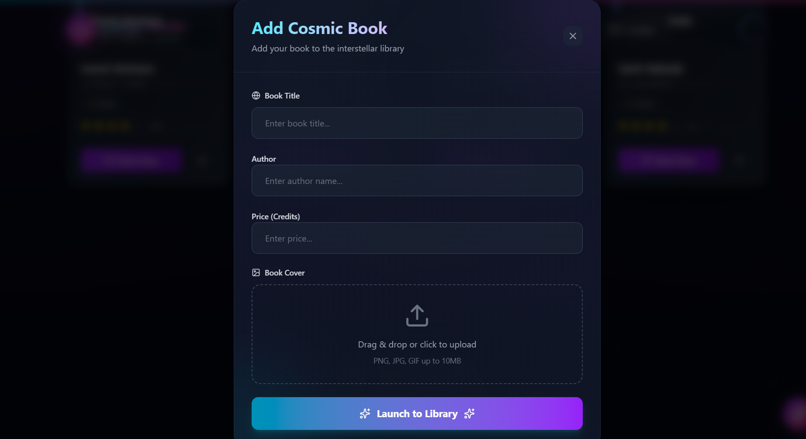

<<<<<<< HEAD
# 🌌 Cosmic Books - Interstellar Library



A stunning cosmic-themed bookstore application that brings the wonders of science fiction literature to life through immersive 3D animations and a space-inspired design. Explore books from across the galaxy with an interactive, visually captivating experience.

## ✨ Features

### 🚀 Core Functionality
- **Interactive Book Cards**: Click any book to reveal detailed descriptions and cosmic lore
- **3D Animations**: Powered by Three.js and Framer Motion for smooth, engaging interactions
- **Shopping Cart**: Add books to cart with real-time updates and persistent storage
- **User Authentication**: Login/signup system with secure user management
- **Book Management**: Admin functionality to add new books with image uploads

### 🎨 Design Features
- **Cosmic Theme**: Nebula backgrounds, star fields, and space-inspired color schemes
- **Responsive Design**: Optimized for desktop, tablet, and mobile devices
- **Smooth Animations**: Fluid transitions and hover effects throughout the interface
- **Modern UI**: Built with Tailwind CSS for a sleek, professional appearance

## 🛠️ Tech Stack

### Frontend
- **React 19** - Modern React with latest features
- **Vite** - Fast build tool and development server
- **Three.js** - 3D graphics and animations
- **Framer Motion** - Animation library for smooth transitions
- **Tailwind CSS** - Utility-first CSS framework
- **React Router** - Client-side routing

### Backend
- **Node.js** - JavaScript runtime
- **Express.js** - Web framework
- **MongoDB** - NoSQL database
- **Mongoose** - MongoDB object modeling
- **Multer** - File upload middleware
- **CORS** - Cross-origin resource sharing

## 📁 Project Structure

```
Cosmic Books/
├── Backend/
│   ├── models/
│   │   ├── Book.js          # Book data model
│   │   └── User.js          # User data model
│   ├── routes/
│   │   ├── auth.js          # Authentication routes
│   │   └── bookRoutes.js    # Book CRUD operations
│   ├── uploads/             # Uploaded book images
│   ├── index.js             # Main server file
│   └── package.json
├── frontend/
│   ├── public/
│   ├── src/
│   │   ├── components/
│   │   │   ├── books/       # Book display components
│   │   │   ├── cart/        # Shopping cart components
│   │   │   ├── cosmic/      # 3D background elements
│   │   │   ├── navigation/  # Navbar and navigation
│   │   │   └── sections/    # Page sections
│   │   ├── contexts/        # React contexts (Auth, Cart)
│   │   ├── pages/           # Main page components
│   │   ├── services/        # API service functions
│   │   └── utils/           # Utility functions and data
│   └── package.json
└── README.md
```

## 🚀 Getting Started

### Prerequisites
- Node.js (v16 or higher)
- MongoDB (local or cloud instance)
- npm or yarn package manager

### Installation

1. **Clone the repository**
   ```bash
   git clone https://github.com/yourusername/cosmic-books.git
   cd cosmic-books
   ```

2. **Backend Setup**
   ```bash
   cd Backend
   npm install

   # Create .env file
   cp .env.example .env
   # Add your MongoDB URI and other environment variables
   ```

3. **Frontend Setup**
   ```bash
   cd ../frontend
   npm install
   ```

### Environment Variables

Create a `.env` file in the Backend directory:

```env
MONGO_URI=mongodb://localhost:27017/cosmic-books
PORT=5000
JWT_SECRET=your-secret-key-here
```

## 🏃‍♂️ Running the Application

### Development Mode

1. **Start the Backend**
   ```bash
   cd Backend
   npm run dev
   ```

2. **Start the Frontend** (in a new terminal)
   ```bash
   cd frontend
   npm run dev
   ```

3. **Open your browser**
   Navigate to `http://localhost:5173` to view the application

### Production Build

```bash
# Build the frontend
cd frontend
npm run build

# Start the backend
cd ../Backend
npm start
```

## 📖 API Endpoints

### Books
- `GET /books` - Get all books
- `POST /books` - Add a new book (with image upload)

### Authentication
- `POST /auth/login` - User login
- `POST /auth/signup` - User registration

## 🎯 Usage

### For Users
1. **Browse Books**: Explore the cosmic collection with interactive 3D cards
2. **View Details**: Click any book to see detailed descriptions
3. **Add to Cart**: Use the "Add to Cart" button to save books for purchase
4. **Authentication**: Create an account or login to access additional features

### For Admins
1. **Add Books**: Use the admin panel to upload new books with images
2. **Manage Inventory**: Update book details and pricing
3. **User Management**: View and manage user accounts

## 🎨 Screenshots

### Homepage


### Book Details


### Shopping Cart


### Admin Panel


## 🤝 Contributing

1. Fork the repository
2. Create a feature branch (`git checkout -b feature/amazing-feature`)
3. Commit your changes (`git commit -m 'Add some amazing feature'`)
4. Push to the branch (`git push origin feature/amazing-feature`)
5. Open a Pull Request

## 📝 License

This project is licensed under the MIT License - see the [LICENSE](LICENSE) file for details.

## 🙏 Acknowledgments

- **Three.js** for 3D graphics capabilities
- **Framer Motion** for smooth animations
- **Tailwind CSS** for styling
- **React** ecosystem for the frontend framework
- **Express.js** for the backend API

## 📞 Contact

- **Author**: Ahmad zubair zahidi
- **Email**: zahidizubair0@gmail.com
- **GitHub**: [Zubair-zahidi](https://github.com/Zubair-zahidi)


---

⭐ **Star this repo** if you found it helpful!


